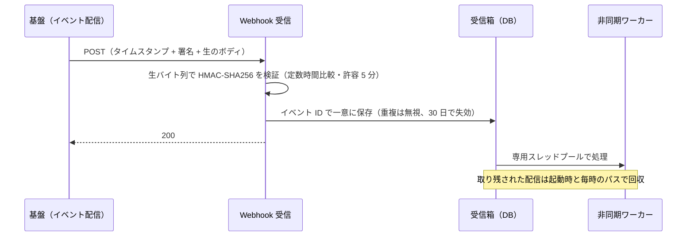

# グループ共通のアカウント・テナント基盤との統合

> **English summary** — Over two months I integrated a multi-tenant B2B SaaS (Scala / Play + React) with a group-wide account and tenant platform: OAuth 2.0 authorization code + PKCE sign-in that ends in the app's existing session, platform-issued Bearer tokens accepted on existing APIs, role re-derivation at every sign-in, signed webhooks processed persist-first and asynchronously, tenant lifecycle sync, hourly device pulls, and one visibility registry for integrated tenants — all behind default-off settings. 18 merged PRs (server 13, frontend/foundation 5). AI agents wrote most of the code; I owned the design, the rulings, the verification and the coordination with the platform team.

## 概要

- グループ共通のアカウント・テナント基盤と既存のマルチテナント B2B SaaS をつなぐ統合を、2026 年 8〜9 月に担当しました（マージ済み PR 18 件）。
- ログイン、既存 API での外部トークン受理、ロールの導出、Webhook、テナント同期、デバイスデータの取得、統合テナント向けの画面の出し分けを、すべて既定オフの設定で段階的に有効化できる形にしました。
- 実装の大部分は AI エージェントが担い、私は設計・判定・検収と、基盤チームとの調整を担当しました。

## 背景

対象の製品は、自前のアカウントとセッショントークンで動くマルチテナント B2B SaaS です。グループとしてアカウントとテナントを共通基盤に寄せる方針が決まり、基盤チームが OIDC 準拠の IdP、テナントごとの issuer、イベント通知、テナント API、デバイス API を提供することになりました。

制約は三つありました。統合しないテナントの挙動は一切変えないこと。基盤側も並行開発中で、仕様が週単位で変わること。共有ステージング環境を複数チームで使っていること、です。

## 課題

1. 認証の入口が増えます（ブラウザの SSO、外部トークンを持つ別クライアント、既存のパスワードログイン）。それでも、下流のセッション処理は一つに保ちたい。
2. 権限の正本がどこにあるのか（基盤の claims か、自アプリの DB か）がはっきりしない。
3. イベント配信には署名、再送、重複、順序の問題がついて回る。
4. 仕様書と実環境が食い違う。
5. 画面の出し分けを、コードのあちこちの条件分岐にしたくない。

## 原因の分析

入口ごとにセッション発行を作ると、失効・更新・ログアウトの扱いが入口の数だけ分かれ、どこか一つが必ず古くなります。そこで、入口では外部トークンを検証するだけにして、その後は既存と同じ自アプリのセッションに変換する方針にしました。下流は何も変えません。

ロールは、基盤側で変わっても自アプリの DB には伝わりません。かといって毎回書き込むと、DB への負荷がかかり、監査ログも汚れます。

Webhook は、受信処理の中で重い処理をすると配信側がタイムアウトし、再送が来て重複します。失敗を返しても再送されるだけで、最後は誰も読まないキューに落ちます。

仕様については、「文書に書かれていない」ことは「存在しない」ことを意味しませんでした。また、「データがある」ことと「自分たちの資格情報で取れる」ことは別の話でした。

## 対策

**認証。** 認可コード + PKCE（S256）を使い、state を開始したブラウザに結びつけます。サーバー側で基盤のトークンを暗号化して預かり、自アプリのセッションを基盤のセッションにつなぎます。基盤が更新を明確に拒否したら自アプリのセッションも失効させ、ネットワーク系の一時的なエラーではセッションを殺しません。テナントは署名済みトークンの `iss` から導き、Host ヘッダーは信用しません。

**既存 API の Bearer 受理。** 既存トークンがないリクエストに限り、`Authorization: Bearer` を同じ検証で解釈します。作るのはメモリ上の認証主体だけで、セッション、トークン、DB への書き込みはどれも発生させません。初回アクセスが並行して来たときの利用者作成は、部分ユニークインデックスと「重複キーなら読み戻す」で一つに収束させました。

**ロール。** 複数クライアントのロールを和集合にし、写像表で自アプリのロールに変換します。変換結果で置き換え（追加ではなく）、DB と同じなら書き込みません。写像できないロールは一般ユーザーに降格し、警告を出します。

**Webhook。** 流れは次のとおりです。

署名シークレットはイベントごとに分け、シークレットストアから注入します。重複した配信にも 200 を返します。200 以外を返すと再送が続くだけだからです。

**テナント同期。** テナントの作成・削除イベントを、排他的な claim と墓標（削除済みの印）で処理し、冪等で順不同にも安全にしました。イベントの情報が足りないときは、client_credentials で基盤に問い合わせます。「相手が明確に拒否した」と「相手に届かない」は区別し、後者は保留にして毎時再試行し、30 日で期限切れにします。

**デバイスデータ。** 基盤はデバイスのイベントを出さないため、テナントごとに毎時一回とテナント作成時に取得します（ページサイズ 200）。取得状態はテナントごとに一行持ち、失敗しても最終成功時刻は消しません。

**画面の出し分け。** 可視性の定義を一つのモジュール（レジストリ）にまとめました。隠すページ 4、タブ 2、セクション 12 と、ログイン後の着地点をここで決めます。統合しないテナントでは、すべての関数が最初に「隠さない」を返すので、構造上ふるまいが変わりません。SPA 側は、ログイン画面へ向かう 20 の出口を一つの認証ゲートに集めました。リダイレクトのループは二段で防いでいます。一回限りのマーカーと、ログイン完了から 60 秒以内にゲートへ戻ってきたらエラーで終える判定です。既存の API は、回復できない原因（7 種類以上）でも同じ 401 を返します。「401 なら再認可」と単純につなぐと、そうした原因のたびに無限ループになります。

**既定オフ。** issuer を設定しなければ外部トークンはすべて拒否、署名シークレットがなければ Webhook はすべて拒否、デバイス取得のフラグは既定で false、テナント単位のフラグも既定は「非統合」です。

**計画と調整。** 関係するチケットを 100 件以上手元にミラーし、判断の台帳（143 件）と、フェーズを止めている未決事項の一覧（ゲート 10 件）で管理しました。基盤チームへの質問は、手元の文書・ソースのスナップショット・実測をひととおり確かめてから出します。候補 11 件を 4 件に絞れた回もありました。基盤チームには、名前と形を凍結したインターフェース契約を先に渡し、並行して実装を進めてもらいました。

## 検証

- **実測を優先しました。** 仕様書ではなく実環境で確かめます。仕様上 3 項目のはずの応答が、実際には 6 項目あったこともあります。事実は日付と、それを測ったコマンドを添えて記録しました。
- **判定表をつけました。** 項目ごとに PASS / FAIL / BLOCKED / DEFERRED を判定し、PASS には観察した出力を引用します。環境で前提条件を作れない経路は BLOCKED とし、PASS にはしません。
- **対照群を置きました。** 部分ユニークインデックスを外した状態で 8 並列の初回アクセスを送ると、重複が 5 件できました。インデックスを戻すと 0 件です。テストが緑であることに意味があるのを、先に赤くして確かめました。
- **タイマーは縮めませんでした。** クラッシュ後の回収は、毎時のタイマーを実際に 69 分待って確認しました。
- **共有環境を汚さずに確かめました。** 一回のブラウザログインから認可コードを二つ取り、自分の id_token でログアウトしたうえで、実際に 630 秒待ちました。

## 結果

実務での実測値です（コードは非公開）。

| 項目 | 結果 | 条件 |
|---|---|---|
| マージ済み PR | 18 件（サーバー 13・フロント / 基盤 5） | 2026-08-07〜09-28 |
| ログイン | ローカル統合テスト 122 件 PASS。共有ステージング 81 項目で 74 PASS・0 FAIL・7 件は人手の確認項目 | それぞれ 2 回連続で同じ結果 |
| 既存 API の Bearer 受理 | 共有ステージング 60 項目 PASS | 2 回連続 |
| ロールの導出 | この変更の検査 87 件 PASS・0 FAIL。変化がないときのロール書き込み 0 回 | ローカル、5 回の起動に分けて実行 |
| Webhook 受信 | 判定 19 項目で 17 PASS・2 BLOCKED | 2026-08-28 |
| テナント同期 | 45 PASS・2 BLOCKED。問い合わせ経路は 21 PASS・2 BLOCKED | 問い合わせ経路は 2 回連続 |
| 開発中に止めた回帰 | ログイン後の着地点が 5 ファイル 11 箇所にハードコードされていたのを、マージ前に修正 | 詳しくは[事例 04](04-unattended-goal-bus.md) |

## 学び

- 入口は増えても、出口（セッション）は一つに保つ。
- 「宣言されていない」は「存在しない」ではない。測るときは、自分たちの資格情報でその経路が通るかまで確かめる。
- 緑を信じる前に、それが赤くなることを確かめる。
- 並行開発の相手には、名前と形を凍結した契約を先に渡す。
- 質問は、手元の資料を尽くしてから出す。

## 関連リポジトリ

- [idp-tenant-integration-demo](https://github.com/MuneAkira6/idp-tenant-integration-demo)：同じ設計を、ローカルの IdP と模擬基盤で動かすデモ（仕様駆動で開発）
- [spec-driven-dev-playbook](https://github.com/MuneAkira6/spec-driven-dev-playbook)：判定表・実測優先・契約の凍結の書き方
- 事例 [04 無人で goal を回す](04-unattended-goal-bus.md)・[05 仕様駆動開発](05-spec-driven-development.md)

デモの実測値です（デモのリポジトリで測ったもので、実務の数字ではありません）。

| 項目 | 結果 | 条件 |
|---|---|---|
| 単体・結合テスト | 186 件すべて成功 | 2026-10-01、実装を行った Linux ホスト（Ubuntu 20.04・Node v24.19.0・Docker 28.1.1）。新しく展開した作業ツリーで 2 回続けて同じ結果 |
| ブラウザのテスト | 8 件すべて成功 | 同上 |
| 受け入れ条件の判定 | 84 行・判定 85 件（PASS 84・BLOCKED 1・FAIL 0） | 仕様から作った goal 包を、バスで無人実装（7 goal・審査 8 回・人の介入 0 回） |
| ガードの対照群 | 7 つのガードすべてで、守りを外すと赤くなることを確認 | 初回接触の一意化、署名の検証、タイムスタンプの許容幅など |
