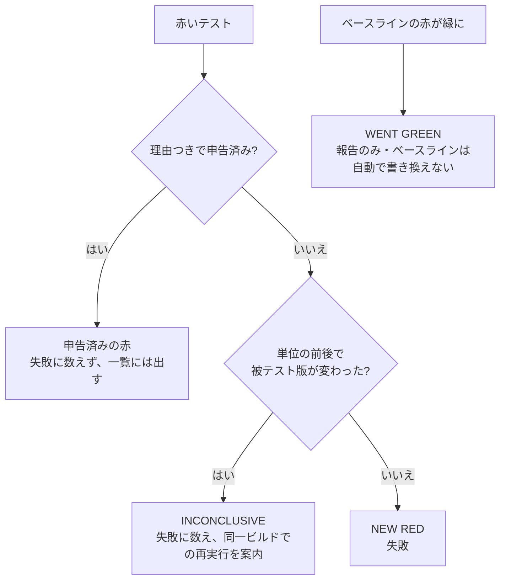

# テスト自動化と品質ゲート

> **English summary** — I built a coverage ledger for a web portal with the functional spec as the denominator (13 areas, 534 scenario rows) and raised coverage from 22.1% to 83.9% (including existing QA assets), automated a 118-case manual regression sheet (89 cases scripted), and put 211 API endpoints under regression. The CI gate splits every failure into new red, declared red, inconclusive (the build under test changed mid-run) and went-green. The rules behind it — pin the build under test, wait for N identical reads, never relax a check that mirrors a product criterion — matter more than the numbers.

## 概要

- Web ポータルの機能仕様書を分母にしたカバレッジ台帳（13 領域・534 行）を作り、計画開始時に 22.1% だったカバレッジを 83.9% まで上げました（既存の QA 資産を含む値）。
- 手動回帰 118 件のうち自動化対象の 89 件をスクリプト化し、211 エンドポイントの API 回帰と合わせて CI に載せました。
- 失敗を「新しい赤」「申告済みの赤」「再デプロイをまたいだ判定不能」「緑に戻った」に分ける品質ゲートを設計しました。

## 背景

テストは手動が中心で、機能仕様書がありながら「どこまでテストされているか」を誰も数えていませんでした。共有ステージング環境は複数チームが使い、一日に何度も再デプロイされます。

## 課題

1. カバレッジの分母がない。書いたテストの数しか数えられず、抜けが見えない。
2. 失敗の意味があいまい。製品が壊れたのか、テストが壊れたのか、途中で環境が変わったのか区別できない。
3. 不安定なテスト（flake）が信頼を削る。

## 原因の分析

分母がなければ、カバレッジは「たくさん書いた」という感覚でしかありません。仕様の側から数え直さない限り、抜けは見えません。

共有環境では、テストの実行中に被テスト版が入れ替わります。そのとき出た赤は、回帰なのかデプロイの境目なのか、ログだけでは区別できません。

不安定さの多くは、待ち方にありました。ローディング表示が消えたかどうかといった状態ビットを待つと、描画途中の値を読んでしまいます。

## 対策

**カバレッジ台帳。** 機能仕様書から「画面 × シナリオ × 変種」を 1 行とする目録を作りました。各行には出典、優先度（P0〜P2）、自動化の可否、どのテストで覆っているかを書きます。数えるのはスクリプトで、手では数えません。そこから作ったギャップ行列で優先順位を決め、12 のストリームで順番に Playwright のテストを足していきました（16 spec・405 test）。

途中で、「別の場所で覆われている」として分母から外していた 17 行を再監査しました。三つの問いを立てました。参照先の行は存在するか。実際に実行されているか。変種の軸が抜け落ちていないか。その結果、8 行は成り立っておらず、うち 6 行は参照先が一度も実行されていませんでした。これらを分母に戻したので、対外的な数字は 84.9% から 83.9% に下がりました。

**手動回帰の自動化。** 手動の 118 件を「対象外 13・手動のまま 16・スクリプト化 89」に分けました。用例 ID、手動テストシート、Playwright の spec の三者を ID で対応させています。最初の回はブラウザを操作するエージェントに 98 件を実行させました。実行と審査は別にし、PASS には観察した画面や出力の原文の引用を必須とし、その有無を検証スクリプトで機械的に確かめました。その後 Playwright に置き換え、CI に載せています。

**API 回帰。** swagger から 211 のエンドポイントを抽出し、パイプラインで 12 グループのコレクションを生成して mabl で実行します（一回約 2.5 分）。修正は生成物ではなく、パイプラインの側に入れます。

**品質ゲート。** テストは単位ごとに 1 プロセスずつ直列に流し、各単位の前後で被テスト版（ビルドの SHA）を読み取ります。赤の集合は、コミット済みのベースラインと比べて分類します。

申告できるのは「赤でも製品が壊れているわけではない」ものだけです。版をまたいで緑になったものは、修正された証拠として扱いません。

**不安定さへの対策。** 読み取った値が N 回続けて一致するまで待ちます。N はコントロールごとに 2〜5 回です。retries は 0 と決め、再試行で赤を隠しません。ネットワークの監視は、クリックより先に仕掛けます。仕上げの段階では、同じファイルを 2 回続けて流し、ケースごとの一致表を作ります。

**判定基準の凍結。** 期待値は仕様と UI の文言表からだけ取ります。ソースコードは観察の説明に使うだけで、期待値を下げる根拠にはしません。製品の判定ロジックをそのまま写したテストは、赤くなっても緩めません。緩めれば、見つけるべきものを測る側から消してしまうことになるからです。

## 検証

- **ゲート自体に負の自己テストを付けました。** 実際に再デプロイをまたいだ過去のログを流すと INCONCLUSIVE になり、同一ビルドのログでは NEW RED のまま残ることを確かめました。既存の経路の出力は、バイト単位で変わっていません。
- **「測る側」を疑いました。** CI でだけ赤くなるケースがありました。同じビルド・同じマシンで、プロキシだけを替えて A/B を取りました（クリックから通信までの時間は 34 ms と 67〜74 ms）。その結果、原因はテスト側の監視の競合だと確定しました。製品の欠陥ではありませんでした。

## 結果

実務での実測値です（コードは非公開。欠陥の件数と内容は載せていません）。

| 項目 | 結果 | 条件 |
|---|---|---|
| UI カバレッジ | 22.1% → 83.9%（P0 は 66 件中 62 件） | 2026-08-12 → 08-29。分母は再監査後の 523 行。既存の QA 資産を含み、今回のスイートだけが覆う行は 333 行 |
| 自動化率 | 17.2% → 81.5% | 同上 |
| 追加したスイート | 16 spec・405 test | 2026-09-01 の全体実行 |
| 手動回帰の自動化 | 118 件中 89 件をスクリプト化（88 件が実行成功） | CI で同じコミットに対し 2 回続けて全件成功（破壊的な操作を除く 87 テスト） |
| API 回帰 | 211 エンドポイント・12 グループ・約 2.5 分 | 実測の所要時間 135 秒 |

CI のワークフローはどれも手動起動で、回帰ゲートとして運用しています。マージのたびに走るゲートにはしていません。

## 学び

- 分母を先に作る。数字は機械で数える。
- 数字をよく見せるより、分母を正直にする。
- 失敗の意味を分類してから、ゲートにする。
- 測る側を疑うときは、変える変数を一つにする。
- 待つのは状態ではなく、読み取り値の安定。

## 関連リポジトリ

- [regression-gate-demo](https://github.com/MuneAkira6/regression-gate-demo)：四分類の品質ゲート、用例 ID・手動シート・spec の対応、カバレッジ報告を小さなサンプルアプリで再現したもの
- 事例 [04 無人で goal を回す](04-unattended-goal-bus.md)：12 のストリームはこの方式で実行しました

デモの実測値です（デモのリポジトリで測ったもので、実務の数字ではありません）。

| 項目 | 結果 | 条件 |
|---|---|---|
| 品質ゲート | 6 単位で `0 NEW RED, 0 INCONCLUSIVE, 1 KNOWN RED, 0 WENT GREEN`（終了コード 0） | 申告済みの赤は、デモにメール送信の経路がないテスト 1 件 |
| カバレッジ | 手動テストシート 23 行中 21 行を自動化、対象外 1 行を除く分母 22 で 95.5% | 分母はテストの数ではなくシート |
| 自己テスト | 34 件すべて成功（うち 12 件はゲートの負の自己テスト） | 四分類と終了コード 0〜3 を、本物のゲートをフィクスチャに対して走らせて出している |
| 再現性 | 上の結果が Ubuntu 20.04 と Windows 11 で同じ | 2026-09-30、新しく展開した作業ツリー |
