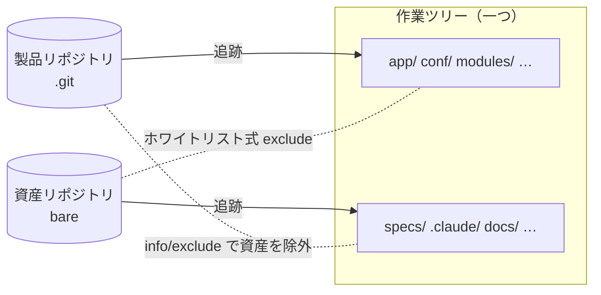

# CI と開発体験

> **English summary** — On a Scala / Play + React codebase I added PR compile checks that run on a team machine registered as a self-hosted runner (about 3 minutes, no hosted minutes, no secrets), traced intermittent "build failures" to non-deterministic Scaladoc generation (5 of the last 12 failures), cut about 2.5 minutes of local startup wait in the devcontainer, automated the OSS license inventory across three ecosystems and QA pre-releases, and set up "two repositories, one working tree" so that AI-agent assets never enter the product repository.

## 概要

- チームの Linux 開発機を self-hosted runner として登録し、PR ごとのコンパイルチェック（約 3 分、Actions の課金枠を使わない）を入れました。
- ときどき起きる「ビルド失敗」を調べ直し、直近 60 日の失敗 12 件中 5 件が Scaladoc 生成の非決定的な失敗だと突き止めて、パッケージ時の Scaladoc 生成を止めました。
- devcontainer の I/O 改善（ローカルの起動待ちを約 2 分 30 秒短縮）、3 エコシステムにまたがる OSS ライセンス一覧の自動生成、QA デプロイ時のプレリリース自動作成、「2 リポジトリ・1 作業ツリー」の資産管理を整えました。

## 背景

バックエンドは Scala / Play、管理画面は React です。開発は Windows 上の devcontainer で行い、社外への通信は認証付きの社内プロキシを通ります。AI エージェントと仕事をするようになって、仕様、スキル、判断の台帳といった資産が急に増えました。

## 課題

1. コンパイルエラーに PR の段階で気づけず、デプロイのときに初めて分かる。
2. 「ビルドが落ちた」が、手元で再現しない。
3. ローカルの起動が遅い。
4. OSS ライセンス一覧を毎回手で作っている。
5. AI 用の資産を製品リポジトリに混ぜたくない。ただし、パスは変えたくない。

## 原因の分析

1. hosted runner は課金枠を使います。社内パッケージを取るには secret も必要になります。それなら、runner を社内に置き、そもそも secret を必要としない構成にすればよいと考えました。
2. 失敗した run を「失敗したステップ」と「エラーのシグネチャ」で分類し、SHA ごとに並べました。同じ SHA で成功と失敗が分かれていれば非決定的です。そうやって残ったのが Scaladoc の生成でした。
3. Windows のバインドマウント越しにビルド成果物を読み書きする I/O が重いことと、起動時に DEBUG ログを 11,471 行書いていたことが効いていました。
4. npm / pnpm、sbt、Gradle で、依存とライセンスの取り方がばらばらでした。
5. `.gitignore` に書くと製品リポジトリの差分に出てしまいます。一方で `.git/info/exclude` に書くと、ripgrep がそれを読むため、検索結果から資産が静かに消えます。

## 対策

**PR コンパイルチェック。** `runs-on` を式にして、既定では self-hosted に流し、手動実行で選んだときだけ hosted に振るようにしました。JVM は認証付きのプロキシを直接使えないため、runner 機の上に中継プロキシを置き、`127.0.0.1` だけにバインドしました。ワークフローの権限は `contents: read` だけで、secret は一つも渡しません。公開リポジトリから取れない依存はリポジトリ内のローカルリポジトリに同梱し、secret なしで依存解決できるようにしました。PR ごとに古い run はキャンセルし、タイムアウトは 25 分と 15 分にしています。ワークスペースは毎回クリーンにし、デプロイと同じ全量コンパイルをします。

**Scaladoc。** チェックでは `compile` ではなく `stage` を実行します。パッケージングで実際に使われるのは `stage` のほうだからです。Scaladoc を止める変更は、関心を一つに絞った別の PR に分けました。

**devcontainer。** `target/` と依存キャッシュを named volume に移し、ログレベルを直し、取得できない依存をリポジトリ内に置きました。

**OSS ライセンス一覧。** ワークフローと生成スクリプトで、CSV・Markdown・第三者ライセンスの案内を出力します。フロントエンドは依存を解析し、バックエンドと Lambda は整備済みの対応表を使います。ライセンスの全文が欠けている依存があれば、ジョブを失敗させます。

**プレリリース。** QA デプロイの最後に、内部の版番号（4.x）を対外の版番号（1.x）に変換し、プレリリースを冪等に作成または修正して、リリースノートを自動生成します。Latest への昇格は、QA の承認会議での判断が必要なので人が行います。

**2 リポジトリ・1 作業ツリー。** 資産用のリポジトリを bare で作り、製品リポジトリと同じ作業ツリーに重ねました。ファイルは一つも移動していないので、既存のパスはそのまま使えます。

製品側は `.git/info/exclude` で資産を除外し、資産側はホワイトリスト式の exclude で自分の担当だけを拾います。ripgrep 対策として、ルートの `.ignore` で除外を打ち消しました。両方のリポジトリが同時に追跡しているパスが 0 件であることを、定期的に確かめています。

あわせて、Lint は Biome を段階的に導入しました（約 3,540 件あった診断のうち、error を 0 件にしました）。npm から pnpm への移行時には、公開から 3 日たった版しか入れない設定と、ビルドスクリプトを許可リストの依存にだけ許す設定を入れています。

## 検証

- **runner。** PR 自身の run で受け入れを確かめました（初回は失敗、修正後に 192 秒で通過）。マージ後の push の run は 119 秒でした。
- **Scaladoc。** 修正後の `stage` のログで、ドキュメント生成の行が 0 になり、成果物にドキュメントが含まれないことを確認しました。ただし、修正後の失敗率はまだ継続して追えていません。
- **devcontainer。** ローカルの起動待ちは、開発者の手元の計測で約 2 分 30 秒短くなりました。
- **2 リポジトリ。** 両方の `ls-files` の積集合が 0 件であることを確かめました。

## 結果

実務での実測値です（コードは非公開）。

| 項目 | 結果 | 条件 |
|---|---|---|
| PR コンパイルチェック | 約 3 分（冷キャッシュ 192 秒・温キャッシュ 119 秒） | チームの共有機、2026-09-04 |
| Actions の課金枠 | 使用なし（hosted で同じ頻度で回した場合の試算は月 8 ドル程度） | — |
| Scaladoc による失敗 | 直近 60 日の失敗 12 件中 5 件 | 2026-09-04 時点 |
| ローカルの起動待ち | 約 2 分 30 秒短縮 | 開発者端末、ローカルのみ |
| Lint | 診断 約 3,540 件 → error 0 件 | Biome の段階導入 |
| 資産の混入 | 両リポジトリが同時に追跡するパス 0 件 | 2026-09-29 に確認 |

## 学び

- self-hosted runner を安全に使う前提は、secret を渡さずに済む構成を作ること。
- 失敗は「ステップ × シグネチャ × SHA」で並べると、非決定性が見える。
- 1 PR には関心を一つ。
- 資産の置き場所は三つの条件で考える。差分に出ないこと、検索から消えないこと、二つのリポジトリで重ならないこと。

## 関連リポジトリ

- [ci-devex-toolkit](https://github.com/MuneAkira6/ci-devex-toolkit)：多エコシステムの OSS ライセンス一覧生成、devcontainer の I/O を A/B で測るツール、self-hosted runner での PR コンパイルチェックのテンプレートと runbook、2 リポジトリ・1 作業ツリーの補助スクリプト

デモの実測値です（デモのリポジトリで測ったもので、実務の数字ではありません）。

| 項目 | 結果 | 条件 |
|---|---|---|
| ライセンス一覧 | 56 依存を分類し、終了コード 0。上書き 2 件を外すと UNKNOWN が 2 件出て、終了コード 1 で失敗 | pnpm・sbt・Gradle の実レポートを入力 |
| devcontainer の I/O（Linux） | 最初の応答までの時間は、バインドマウントと named volume でほぼ同じ（比 1.00） | 実装を行った Linux ホスト（Ubuntu 20.04）。1 アーム 5 回、1,000 モジュール |
| devcontainer の I/O（Windows） | 最初の応答までの時間が、バインドマウント側で 23.5 倍（2 回目の計測では 25.8 倍） | Windows 11 の Docker Desktop。条件は同上 |
| 中継プロキシの試験 | 7 件すべて成功（資格情報が誤っていれば 407 になる対照を含む） | Docker Compose で上流と中継を立てて試験 |
| 2 リポジトリ・1 作業ツリー | 自己テスト 11 件すべて成功（違反を 4 種類わざと作り、名前付きで報告させる対照を含む） | gawk と mawk の両方 |

実務で効いた devcontainer の改善と同じ向きの差は、Windows でだけ現れました。Linux では差がほとんど出ません。
