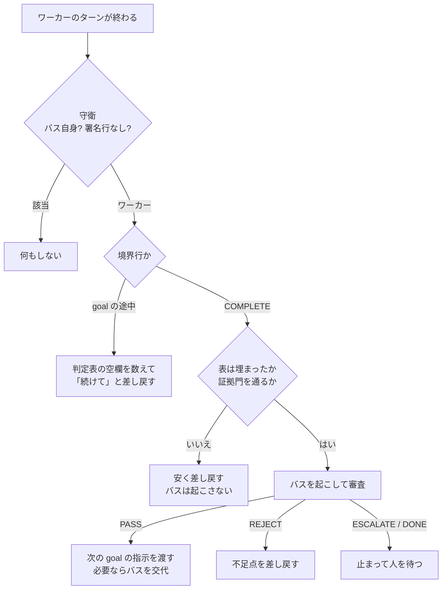

# 無人で goal を回す：長命バス方式の設計と教訓

> **English summary** — A method for running long, multi-goal agent work with nobody at the keyboard. A worker session executes goals; a long-lived "bus" session — the one that wrote the whole goal pack — reviews every goal boundary and writes the next goal's instructions; two Claude Code Stop hooks keep the loop honest by reading files, not conversation. I used it for 18 runs (Aug–Sep 2026). The hard part was never the happy path but the silent failures: 30 lessons came out of them, each tied to a guardrail and a self-test. One gap — notifications — is deliberately left open.

## 概要

- 複数のチケットにまたがる長い作業を、人が張り付かずに進めるための方式を設計し、実務で 18 回運用しました（2026-08-07〜09-09）。
- 実装を担うワーカーの会話、goal の境界で審査する長命の「バス」の会話、ファイルを読んで進行を制御する 2 つの Stop hook で構成します。
- 止まったことに誰も気づかない種類の失敗を一つずつ潰し、教訓 30 件と、それぞれに対応する自己テストにまとめました。通知の穴は未解決のまま明記しています。

## 背景

AI エージェントに大きな仕事を一度に渡すと、壊れ方はたいてい四つです。コンテキストが失われる、判断の基準がずれていく、検証できない「完了しました」が返ってくる、間違いに気づいたときの手戻りが大きい。どれもエラーにはならず、「できました」と報告されるのが厄介なところです。

Claude Code の `/goal` を使えば、目標を達成するまでエージェントを続けさせられます。ただし達成を判定する評価者は小さなモデルで、ツールを呼ばず、会話しか見ません。

## 課題

1. 完了の判定を、会話ではなくファイルで行いたい。
2. goal の間の引き継ぎ（前の goal の結果を踏まえて次の指示を書くこと）を、毎回人がやっている。
3. 無人で回すと、止まったことに誰も気づかない。

## 原因の分析

評価者は判定表（PROGRESS.md）を読めないので、捏造された引用も見抜けません。引き継ぎには前の goal で分かったことが必要で、新しく立ち上げた会話には書けません。goal 包を書き、全体を知っている会話だけが書けます。そして Stop hook は「ターンが終わったとき」にしか動きません。止まるというのは「どのターンも終わらない」ことなので、hook は原理的にそれを検出できません。

## 対策

役割は三つです。**ワーカー**は goal-brief を唯一の入口として AC を一つずつ判定表に書き込み、ターンの最後に必ず進捗行（`PROGRESS: G2 COMPLETE` など）を出します。この行はワーカーであることの署名も兼ねます。**バス**は goal 包を書いた長命の会話で、goal の境界でだけ起こされ、審査して、最後に機械可読の裁決（PASS / REJECT / ESCALATE / DONE）と次の指示を返します。**hook** は二つあり、進行を回しながら、安いチェックで嘘の完了を止めます。

証拠門は、PASS なのに証拠欄が空、引用符がない、「問題なし」のような曖昧な言葉だけ、FAIL が「期待 / 実際」の形になっていない、といった低レベルの問題を約 2 秒で差し戻します。バス（数分・数ドル）に届くのは、引用が質問に答えているか、観察が AC を証明しているか、前の goal と矛盾していないか、といった高レベルの問いだけです。

ほかに、次の仕組みを入れました。
- **上限。** バスの起床回数、同じ goal の差し戻し回数、goal 内のターン数、証拠門の連続ブロック数に上限を設けています。上限は、一回の実走で実際に必要になった数を測ってから決めます。
- **交代。** バスのコンテキストは、トランスクリプトの最後の usage で測ります（ヘッドレス実行の結果 JSON にある累計値は約 10 倍に膨らむため使いません）。閾値を超えたら、きれいな PASS の境界でだけ交代し、引き継ぎ書と長期メモで次のバスに渡します。
- **fail open。** 異常はすべて「止まって人を待つ」に倒します。
- **判定語彙は 2 層。** goal 層の裁決（PASS / REJECT / ESCALATE / DONE）と、AC 層の判定（PASS / FAIL / BLOCKED / DEFERRED）は混ぜません。

## 検証と運用実績

**最初の本番運用**（2026-08-07、約 6 時間）では 6 goal を実行し、裁決 9 回のうち REJECT が 3 回でした。3 回とも実際の問題を捉えています。判定は 100 行で、FAIL は 0 でした。人の介入は 1 回だけです。hook が、成功していた審査を「利用上限による失敗」と誤判定して捨ててしまい、人がトランスクリプトから回収しました。hook はその日のうちに直し、教訓にしています。バス側の費用は、CLI が報告する `cost_usd`（API 換算値で、実際の支出ではありません）で約 21 ドルでした。

この運用で止めた回帰があります。ログイン後の着地点が、5 ファイル 11 箇所にハードコードされていました。ワーカーは「4 ファイル 10 箇所」と報告し、修正を最後の goal に回そうとしました。バスは自分で数え直して 11 箇所目を見つけ、「この goal で入れた回帰は、この goal で直す」として差し戻しました。マージ前のことです。

その後、**UI カバレッジの 12 ストリーム**で使いました。判定は 446 行、バスの起床は 113 回、REJECT 16 回、ESCALATE 15 回です。後半は、ストリームを自動でつなぐ連結器で 7 ストリームを引き継がせました。最後の区間は 16 時間 37 分連続で動き、キューが尽きたところで自分で止まりました。

REJECT の中身を見ると、多くは証拠と記帳の不正確さでした。判別力のない判定基準、測っていない環境についての結論、推算のままの数字、PASS なのに成果物が変わっていない、などです。バスが人の誤りを止めた場面もあります。発車時に閂（有効化フラグ）を立てることを拒否したり、人の主張を実測で否定したりしました。

## 静かに止まる失敗

うまくいった運用より、黙って止まった運用のほうが学びは多くありました。

- ワーカーがターンを進捗行ではなく報告文で終えた。hook はそれを境界と判定できず、誰も起こされないまま 77 分止まった。
- 長いジョブをバックグラウンドに切り離してからターンを終えた。結果は誰にも回収されなかった。
- Ubuntu の既定の awk（mawk）は区間正規表現に対応しておらず、判定表の解析が静かに盲目になった。空の表でも「すべて判定済み」と表示された。
- 監視スクリプトが、トランスクリプトの中のプロトコル文字列（指示書に載っている例文）に反応して、存在しない境界を報告した。

こうした失敗がそのまま方式を育てました。自己テストは 37 件から 55 件、62 件に、教訓は 14 件から 21 件、30 件に増えています。

## 結果

実務での実測値です（コードは非公開）。

| 項目 | 結果 | 条件 |
|---|---|---|
| 運用回数 | 18 回（UI カバレッジ 12・その他 6） | 2026-08-07〜09-09 |
| 最初の本番運用 | 6 goal・裁決 9（REJECT 3）・判定 100 行で FAIL 0・人の介入 1 回 | 2026-08-07、約 6 時間 |
| UI カバレッジ 12 ストリーム | 判定 446 行・起床 113・REJECT 16・ESCALATE 15 | 2026-08-12〜08-28 |
| 最長の連続無人区間 | 16 時間 37 分（7 ストリームを自動で引き継ぎ） | ストリーム連結器による |
| 教訓 | 30 件（それぞれに防護と実装位置） | — |
| 通知チャネル | 7 種を実測。4 種は「成功と報告するが何も届かない」 | 手元の Windows 環境 |

## 学び

- 続けるかどうかの判断は、会話ではなくファイルに置く。
- 安いチェックを先に、高い審査は境界だけに。
- 護欄は時間とともに進む量にアンカーし、導入時に一度わざと発火させて、鳴ることを確かめる。
- 受け入れの判定は、トランスクリプトの文字列ではなく、成果物と hook 自身のパーサーを見て行う。
- **通知の穴は開いたままです。** Stop hook は「何も起きていない」ことを検出できません。届くことを確かめられたチャネルがないため、通知の仕組みは同梱していません。解決済みとは書きません。
- バスの手抜き（中身を見ずに通すこと）は機械では防げません。審査の本文を別ファイルに残し、人が抜き取りで監査します。

## 関連リポジトリ

- [goal-bus-kit](https://github.com/MuneAkira6/goal-bus-kit)：この方式を任意のリポジトリに導入できるよう作り直したツールキット（hook・自己テスト・テンプレート・教訓・説明資料・小さな実走記録）
- [idp-tenant-integration-demo](https://github.com/MuneAkira6/idp-tenant-integration-demo)：仕様駆動で書いた仕様を goal 包にし、この方式で実装まで回した記録
- 事例 [05 仕様駆動開発](05-spec-driven-development.md)

デモの実測値です（デモのリポジトリで測ったもので、実務の数字ではありません）。

- goal-bus-kit の自己テストは、Ubuntu 24.04 と Ubuntu 20.04（どちらも gawk と mawk）で、リレー 171 件・証拠門 35 件がすべて成功しました。Windows の Git Bash でも、mawk がないための 1 件ずつのスキップを除いてすべて成功です（2026-10-05、公開前に実装層を書き直した後の版）。
- 小さな題材での実走では、3 goal・判定 24 行がすべて PASS、審査 3 回、人の介入 1 回でした。介入の原因は hook に認証トークンが届かず、バスを起こせなかったことです。キットを直し、テストを足しました。
- このポートフォリオの次の 6 つのリポジトリは、それ自体をこの方式で無人実装しました（実装を行った Linux ホスト、2026-09-30〜10-06、Claude Code 2.1.233、バスとワーカーはどちらも Opus の 1M コンテキスト）。

| リポジトリ | goal | 判定の行 | 審査（うち REJECT） | 所要時間 | 人の介入 |
|---|---|---|---|---|---|
| spec-driven-dev-playbook | 4 | 37 | 5（1） | 約 1 時間 19 分 | 0 |
| regression-gate-demo | 4 | 35 | 5（1） | 約 1 時間 55 分 | 0 |
| idp-tenant-integration-demo | 7 | 84 | 8（1） | 約 2 時間 42 分 | 0 |
| ci-devex-toolkit | 6 | 65 | 7（1） | 約 2 時間 16 分 | 0 |
| agent-skills-with-evals | 6 | 84 | 9（3） | 約 6 時間 23 分 | 1 |
| labs | 6 | 82 | 7（1） | 約 2 時間 8 分 | 0 |

agent-skills-with-evals の介入 1 回は、バスが審査の中でテストを走らせ直し、モックを立てて確かめているうちに、hook が 1 回の審査に許す上限（29 分）で打ち切られたためです。上限を 45 分に上げ、同じワーカーを再開しました。labs は、作者の都合で G4 の後に一晩止め（キットの計画停止。goal の境目で止まります）、翌朝同じワーカーを再開しました。labs の所要時間は、止めていた一晩を除いた時間です。最初の 5 つは公開前に実装層を書き直す前のキットで、labs だけは書き直した後のキットで走らせています。手順（プロトコル）は同じです。

8 回の REJECT が指したのは、手引きの事実誤り（ツールの版で挙動が変わっていた）、カバレッジの数え方（計画の列を読んでいて、実際のテストを見ていなかった）、台帳の記帳、合計行の数え違い、結果ファイルに実行環境の絶対パスが入る作り、測定結果の読み違い（汚染の印の内訳、どちらも空の 2 回を「一致」と表示）、公開前チェックの表と実際の検索コマンドの食い違い、上書きされた結果ファイルの古い数値の引用です。cost_usd（CLI が報告する API 換算値で、実際の支出ではありません）は 6 回の合計で、バス側 $141.74（このほかに、打ち切られた審査が $7.07）、ワーカー側 $391.19 でした。

regression-gate-demo の実行では、ワーカーが CI の準備手順を実行ホストで試し、ホストの pnpm を約 1 分使えなくしました（ワーカー自身が使える状態に戻し、台帳に記録）。これを受けて、キットのテンプレートの禁止事項に一行足しています。
