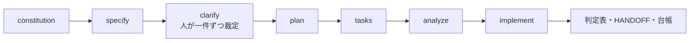

# 仕様駆動開発（SDD）の実践

> **English summary** — How I ran spec-driven development with AI agents on a legacy monolith, starting from GitHub's spec-kit. The spec folder — not the ticket — is the requirement; contracts go from FROZEN to AS-BUILT; whatever the environment cannot produce is BLOCKED, never PASS; and every claim about an external system carries the command that measured it. 46 spec folders since October 2025; clarify went from 4 of the first 32 folders to 12 of the latest 14.

## 概要

- GitHub の spec-kit をもとに、レガシーなモノリス・Windows 環境・「AI にブランチを触らせない」運用に合わせて調整した仕様駆動開発を実践しました。
- 原則は三つです。specs/ のフォルダが仕様であってチケットの文面は要件ではない。環境で前提を作れないものは BLOCKED。外部システムについての事実には、測ったコマンドを添える。
- 2025 年 10 月から 46 の仕様フォルダを作りました。clarify を実施したフォルダは、初期の 32 件中 4 件から、直近の 14 件中 12 件に増えています。

## 背景

AI エージェントに実装させると、要件の読み違い、確かめていない前提、「動くはずです」が混ざり込みます。チケットの受け入れ条件が空だったり古かったり、別のチケットのコメントで閉じられていたりすることもありました。

## 課題

1. 何が要件なのかが揺れる。
2. 人が裁定すべき事項を、AI が自分で埋めてしまう。
3. 外部の仕様書と実環境が食い違う。
4. テストが緑でも、本当に検証されたのかが分からない。

## 原因の分析

要件の正本が一つに決まっていないので、エージェントはその時々で読みやすい文面を正と見なします。clarify を飛ばすと、決めていないことが「妥当なデフォルト」として黙って仕様に入ります。外部システムを仕様書だけで設計すると、宣言されていない項目は存在しないものとして扱われてしまいます。さらに判定の語彙があいまいだと、「環境がなくて試せなかった」が「問題なし」に化けます。

## 対策

**流れと使い分け。**

どの方式を使うかは、書き出した基準で選んでいます。単一のチケットで関心が一つ、難所が人の裁定にあるなら SDD。複数のチケットをリレーし、受け入れ条件を表にできるなら長命バス方式（[事例 04](04-unattended-goal-bus.md)）。目標ははっきりしているが、未知の部分が実際に動かさないと分からないなら、どちらも使いません。その場合も、凍結した裁定と、項目ごとの判定台帳という規律だけは借ります。

**テンプレートの調整。** プロジェクト憲法 7 条（ブランチを作らない・切り替えない、推測より論理の確認を優先、チームの方針に合わせたテスト方針など）を置き、仕様テンプレートに権限（RBAC）の節を必須で加えました。plan には憲法ゲートを、tasks には手動検証と論理検証のチェックリストを入れています。フォルダは現在のブランチ名からだけ作るスクリプトにして、エージェントがブランチを作る余地をなくしました。

**起動プロンプト。** SDD の会話を始める前に、次のエージェントへの「起動書」を書きます。中身は、確定した事実（出典つき、再調査不要）、仕様を左右する制約、clarify で人に一件ずつ渡す裁定事項の一覧（AI は埋めない）、手順、検証の規則、今回有効な憲法の条項、仕上げのチェックリストです。

**判定の語彙。** PASS には観察した出力の原文を引用します。FAIL は「期待 X / 実際 Y」と書けるときだけ使います。BLOCKED は環境で前提を作れないときに使い、手で直した環境で通ったものも「作れない」側に入れます。そのテナントが動いたことは示せても、製品が動くことの証明にはならないからです。DEFERRED は未裁定の事項に依存するときに使います。注記付きの PASS や、一つの項目を半分ずつ判定する複合判定も認めています。

**契約のライフサイクル。** 並行して開発する相手には、名前と形を凍結した契約を先に渡しました。実装が終わったら、一つずつ照合して AS-BUILT に書き換えます。凍結後の修正は 13 件ありましたが、名前や形を変えたものは 0 件でした。

**実測を優先。** 外部システムについての結論は、日付、測ったコマンド、その出力を添えた事実表に記録します（約 40 件）。その事実に依存する前には測り直します。覆されたら「置き換え済み」の枠を足し、原文は消しません。仕様書では 3 項目のはずの応答が、実際には 6 項目あったこともありました。データがあるかどうかだけでなく、自分たちの資格情報でその経路が通るかまで測ります。

**台帳。** 判断は安定した ID で参照し、内容を別の場所で繰り返しません。最後の 1 件がいまの状態を表します。1 件は 40 行以内です。この上限は途中から入れたルールです。導入の直前の 1 週間は 14 件で約 1,400 行になり、1 件が 107〜142 行に膨らんでいました。導入後は、上限を定めた条目自体を除く 23 件のうち、超えたのは 1 件だけです（2026-09-29 時点）。

## 検証

- analyze が、実装前に問題を捕まえた記録が 5 件あります。要件のカバーが 21 件中 19 件にとどまっていたのを 21 件にした例や、コンパイルが通らない定数名の誤りを見つけた例です。
- 判定表の例です。Webhook の受信では 19 項目 = PASS 17・BLOCKED 2・FAIL 0。別の機能では 32 項目 = PASS 21・FAIL 0・BLOCKED 7・INFO 4 で、環境で走らせられない経路は BLOCKED のまま残しました。
- 検証の規律として、2 回続けて同じ判定になったものだけを数えます。被テスト版を先に固定します（成果物の指紋を照合）。再実行のときは「今回カバーしていないもの」も書き出します。

## 結果

実務での実測値です（コードは非公開）。

| 項目 | 結果 | 条件 |
|---|---|---|
| 仕様フォルダ | 46 件（うち直近 14 件） | 2025-10〜2026-09 |
| 主な成果物 | spec 14・plan 14・tasks 13・HANDOFF 16 | アーカイブを除く |
| clarify の実施 | 32 件中 4 件 → 14 件中 12 件 | 初期のフォルダと直近のフォルダの比較 |
| 判定表の有無 | 32 件中 3 件 → 14 件中 14 件 | 同上 |
| 凍結した契約 | 凍結後の修正 13 件・改名や変形 0 件 | — |
| 事実表 | 約 40 件（すべてに測定コマンド付き） | — |
| 判断の台帳 | 143 件 | 2026-08-05〜09-29 |

## 学び

- 要件の正本は一つ（specs/）に決める。
- 人が裁定すべきことは、AI に埋めさせない。
- 宣言されていないことは、存在しないことを意味しない。
- 緑より BLOCKED のほうが正直な場合がある。
- ルールは途中から入れても、効果を数字で示せる。
- SDD と長命バス方式は構造が同じ形をしています（受け入れ条件 → 事前の処置 → 判定と証拠）。ただし実務では別々に使っていました。両者をつなぐ流れは、デモで新たに組んだものです。

## 関連リポジトリ

- [spec-driven-dev-playbook](https://github.com/MuneAkira6/spec-driven-dev-playbook)：この事例の手順・判定語彙・台帳・起動プロンプトのテンプレート（spec-kit 本体は[上流](https://github.com/github/spec-kit)を参照）
- [idp-tenant-integration-demo](https://github.com/MuneAkira6/idp-tenant-integration-demo) の `specs/`：SDD の成果物を一式残した完全な実例

デモの実測値です（デモのリポジトリで測ったもので、実務の数字ではありません）。

| 項目 | 結果 | 条件 |
|---|---|---|
| 手引きとテンプレート | 手引き 348 行、テンプレート 10 本（すべて手引きから参照） | spec-driven-dev-playbook、2026-09-30 |
| 自己検査 | リンク 44 件を 24 ファイルで検査して問題 0、用語の検査 12 ファイルで指摘 0、テスト 14 件成功 | 同上 |
| 仕様一式 | 要件 FR-001〜FR-035、作業 T001〜T070、検証シナリオ Q1〜Q18。clarify では人が 7 件を一件ずつ裁定 | idp-tenant-integration-demo、spec-kit v1.0.12 |
| analyze | 2 回実行し、見つかった 15 件（8 件と 7 件）を実装の前にすべて解消 | 1 回目の 8 件は検査の作業として追加 |
| 実装 | 仕様から作った goal 包をバスで無人実行し、判定 85 件のうち PASS 84・BLOCKED 1・FAIL 0 | 判定と証拠は goal-pack/PROGRESS.md |
