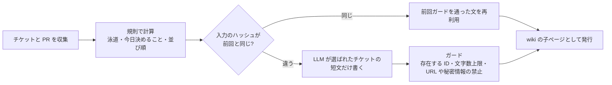

# 日々の開発での AI 活用：スキルと評価、朝会ダイジェスト、ローカル LLM、チームへの展開

> **English summary** — Beyond the two orchestration methods: 16 self-authored agent skills, 7 of them with A/B eval suites (plus lessons on how to read those evals); a standup digest that runs on cron at 08:30 every weekday for about 7k tokens a day, paid from my own plan; a local LLM on a GPU-less laptop (Ollama + Gemma 4 26B); and team enablement — a 24-slide deck I presented to the team, a prompt-design methodology document, and onboarding support for a new member.

## 概要

- 自作した Claude Code のスキル 16 個のうち 7 個に A/B の評価を付けました。あわせて、評価結果をどう読むかの教訓もまとめました。
- 平日 08:30 に cron で動く朝会ダイジェストを作りました（1 日約 7k トークン、費用は自己負担）。
- GPU のないノート PC でローカル LLM（Ollama + Gemma 4 26B）を検証し、チームにも展開しました。説明資料 24 枚の発表、プロンプト設計の方法論文書、新メンバーの立ち上がり支援です。

## 背景

エージェントに任せる仕事が増えるにつれ、同じ説明を何度もプロンプトに書く無駄と、スキルを直したときに本当に良くなったのか分からない問題が目立ってきました。朝会では、チケットの状況を口頭で確かめるのに時間がかかっていました。

## 課題

1. スキル同士の担当範囲が重なり、どれが呼ばれるか分からない。
2. スキルを直しても、効果を示せない。
3. 朝会の準備を LLM に任せたいが、費用と誤りが心配。
4. 方法を個人の技にとどめず、チームで使えるようにしたい。

## 原因の分析

スキルの説明文に「何をしないか」が書かれていないと、似たスキルの間で取り合いが起きます。評価がないと、改善は印象の話で終わります。LLM に全部を任せると、並び順や件数といった規則で決まるはずの部分まで毎日揺れ、費用もかさみます。

## 対策

**スキルの役割分担。** テスト系の 5 つのスキルは「一つの車線に一つ」と決め、説明文に兄弟スキルの名前と区別の軸（デプロイ済み環境か、ブラウザを使うか、どの SaaS か）を書き入れました。

**評価。** スキルあり・なし（または改修前のスナップショット）で A/B を取ります。採点は、機械的なチェックと、証拠付きの判断問題の組み合わせです。回ごとに結果の読み方（基準線の汚染、判別力）を書き残し、評価で見つかった欠陥はスキルに戻しました。Windows では公式の起動判定の評価が毎回「未起動」を返してしまうことが分かり、自分でプローブを書いて置き換えました。その過程で、公開仕様の上限（1,024 字）を超えた説明文が途中で切られ、末尾の除外条項がまるごと消えていたことも見つけています。

評価の読み方として残した教訓です。
- 基準線は、すでに公開された成果物を読んで汚染されることがある。
- その日の事実に釘付けした断言は、1〜4 日で腐る。
- 差がゼロでも、それが正しい結果のことがある。
- サブエージェントの報告は証拠であって結論ではない。
- フィクスチャとスキルが同じ知識から作られていると、試験問題を教えているのと変わらない。

**朝会ダイジェスト。** 規則で決められる部分は規則で決め、LLM は最後の短文だけを担当します。

「活動」として数えるのは、状態の遷移、コメント、PR の更新、本文や添付の編集だけです。スプリント計画で一斉に更新日時が変わる操作は数えません。LLM が失敗しても表は発行します。表こそが本体だからです。ページのコメント欄が、翌日の AI への指示の窓口になっています。

**ローカル LLM。** GPU のないノート PC で Ollama と Gemma 4 26B を動かし、手順をまとめました。型番の選び方、実測速度、Docker と同居させるときのメモリの目安、IDE と連携したときにコンテキストが切り詰められる罠、思考モードによる遅延を書いています。

**チームへの展開。** 長命バス方式の説明資料（24 枚。中国語の原版と日本語訳の 2 版で、スライドごとにそのままコピーして使えるプロンプト付き）をチーム内で発表しました。エージェント向けのプロンプト設計の方法論も、英語の文書にまとめています。主張は「プロンプトを磨くより、環境を設計する」で、七つの原則からなります。2026 年 8 月からは、新しく入ったメンバー 1 名の立ち上がりを支援しました。

## 検証

- 評価はスキルごとに A/B で取り、判断問題は証拠付きで採点しました。ただし、各腕の実行は 1 回ずつです。ばらつきはまだ測れていません。
- 朝会ダイジェストは、ガードの負の自己テスト 3/3、手作業との突き合わせ、一時的な cron 行が実際に起動することの確認を経て稼働させました。

## 結果

実務での実測値です（コードは非公開）。

| 項目 | 結果 | 条件 |
|---|---|---|
| 評価付きスキル | 7 個（自作 16 個中） | — |
| 評価例：朝会ダイジェスト | 22/23 対 20/23（スキルあり / なし） | 2026-09-04、各腕 1 回 |
| 評価例：長命バス方式のスキル | 28/28 対 21/28。起動判定は正例 10/10・負例 10/10 | 2026-08-07 |
| 朝会ダイジェスト | 2026-09-04 稼働、09-07 に初めて無人で発行 | 平日 08:30 の cron |
| ダイジェストの消費 | 1 日約 7k トークン（入力 6,688・出力 443） | 2026-09-07 の実測 |
| ローカル LLM | 毎秒 10.1 トークン | Gemma 4 26B、GPU なしのノート PC |

## 学び

- 規則で決まる部分は規則で決め、LLM は最後に使う。
- 評価は、結果の読み方まで含めて設計する。
- 費用は、入力が変わらなければ呼ばない工夫で抑える。
- 方法は、コピーして使える形にしてから人に渡す。

## 関連リポジトリ

- [agent-skills-with-evals](https://github.com/MuneAkira6/agent-skills-with-evals)：汎用のスキル 3 つと、それぞれの評価一式（フィクスチャ・期待値・実行スクリプト）。朝会ダイジェストは、GitHub の milestone から朝会のページを作る形に作り直しています

デモの実測値です（デモのリポジトリで測ったもので、実務の数字ではありません）。

- 起動率（1 問 3 回、陽性 10 問・陰性 10 問、Linux ホスト、Claude Code 2.1.233）は、陽性が 3 つのスキルで 10/10・9/10・8/10、陰性は 3 つとも 10/10 でした。タイムアウトした 1 回は陰性として数えず、壊れた実行として別に報告しています。
- 3 回の率は率ではありません。閾値の近くの 7 問を 6 回で測り直すと、5 問の率が動き、2 問は合否が入れ替わりました。
- A/B（スキルあり・なし、計 14 回の実行）では、差が大きい eval（機械判定 4/4 対 1/4、12/12 対 1/12）と、差がまったくない eval（4/4 対 4/4、5/5 対 5/5）の両方を、そのまま載せています。
- 実行の後に Windows で確かめ、Linux では現れない不具合を見つけて直しました。評価ランナーが採点モジュールを読み込めず、それが「未採点」として隠れていたこと、プローブが一時ディレクトリを消せないと測定結果ごと失っていたこと、などです。
